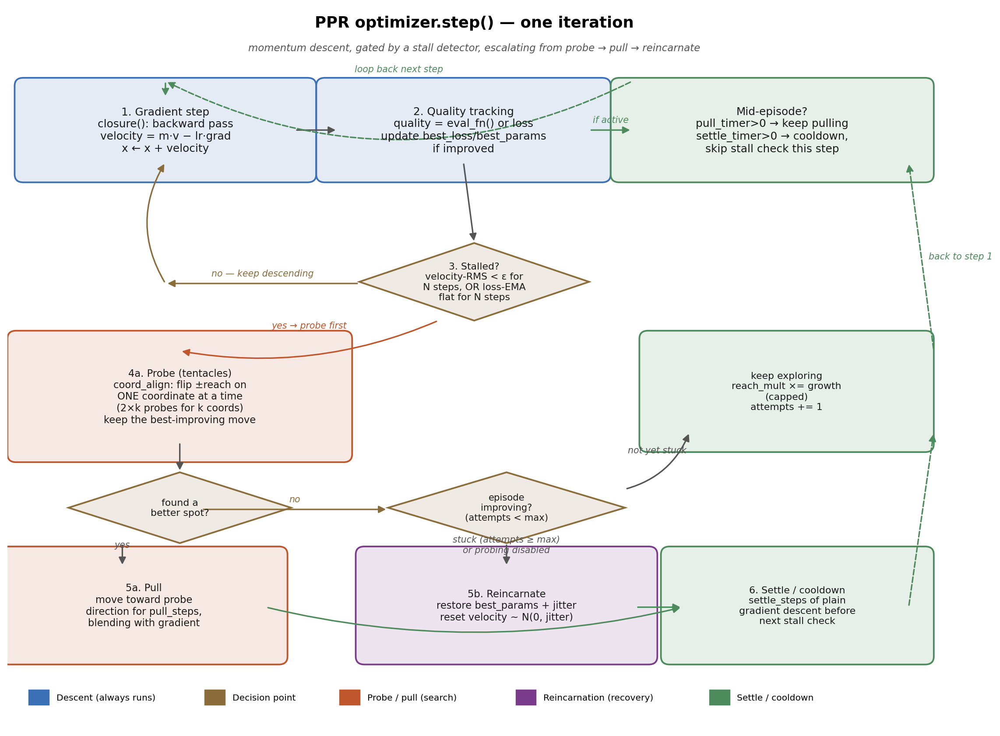

# PPR — Probe-Pull-Restart

A PyTorch `torch.optim.Optimizer` that augments SGD-with-momentum with two
add-on mechanisms aimed at escaping bad basins during training:

- **Tentacle probing** — when training stalls, fire cheap trial moves from
  the current position, and if one finds a lower-loss spot, steer toward it
  for a while.
- **Reincarnation** — when repeated probing fails to make progress, roll
  back to the best checkpoint seen so far (plus a small jitter) and restart
  from there.

This repo contains the optimizer implementation, a series of experiments
that stress-tested it against `SGD+momentum`, `Adam`, and `AdamW`, and a
running research log of what was actually found — including a rejected
hypothesis, a structural fix, and one full retraction after a bug was
discovered mid-study. Nothing below is aspirational; every number cited
comes from a script in this repo you can re-run yourself.

**Current headline result:** PPR is neutral-to-matching on tasks the base
optimizer already handles well (MNIST, digits — both full-batch and
mini-batch, once a bug was fixed) and shows a genuine, reproducible
improvement only in one tested regime: low-dimensional non-convex synthetic
landscapes (Rastrigin, ≤5-D). See [Status of the research](#status-of-the-research-questions)
below for the honest, un-hedged version.

---

## How PPR works

PPR wraps ordinary momentum descent in a small state machine. Every call to
`optimizer.step()` always does the momentum update first; everything else
is a rare, gated escalation on top of it.



1. **Gradient step** — same as `SGD(momentum=...)`: `closure()` runs the
   forward/backward pass, and the parameters move by
   `velocity = momentum·velocity − lr·grad`.
2. **Quality tracking** — the current loss (or, if `eval_fn` is supplied, a
   loss computed on a fixed held-out set) is compared against the best seen
   so far; if it's a new best, the full parameter vector is checkpointed.
3. **Stall detection** — a counter tracks whether training is making
   progress:
   - *velocity mode*: stalled when the RMS of the velocity vector stays
     below `stall_eps` for `stall_steps` consecutive steps.
   - *plateau mode*: stalled when an EMA of `eval_fn()` fails to improve by
     `stall_eps` for `stall_steps` steps. Robust to mini-batch noise;
     requires `eval_fn` to be passed to `step()`.
   - *auto* (default): uses plateau mode if `eval_fn` is given, else falls
     back to velocity mode.
4. **Probe** (`tentacles=True`) — once stalled, try a handful of small
   trial displacements from the current point and evaluate the loss at
   each (via `loss_only_fn`, a forward-only closure — this is why probing
   is gated behind a rare stall event: each probe costs one extra forward
   pass). See [probe modes](#probe-modes) below for how directions are
   chosen.
5. **Pull or reincarnate**:
   - If a probe beat the current loss by more than `accept_tau`, **pull**:
     nudge the optimizer toward that direction for `pull_steps` steps,
     blended with the ordinary gradient.
   - If not, and the episode hasn't improved on its own best for
     `max_attempts` consecutive stalls, **reincarnate**: restore the best
     checkpoint (+ tiny Gaussian jitter) and reset velocity.
6. **Settle** — after a pull or a reincarnation, `settle_steps` of plain
   gradient descent run before the stall detector is checked again, so the
   optimizer isn't immediately re-triggered by its own disruption.

### Probe modes

The direction(s) tried in step 4 are controlled by `probe_mode`. This is
the single most consequential setting in the whole optimizer — see
[Findings](#status-of-the-research-questions) for why.

| Mode | Direction(s) tried | Behaves at high dimension? |
|---|---|---|
| `"random"` | `probe_dirs` random unit vectors in full (or subset) parameter space | **No.** Success probability falls as `p_1D^k` because all *k* moved coordinates must simultaneously land in a better spot. Collapses to 0% by ~20 parameters on Rastrigin. |
| `"grad_subspace"` | Random linear combinations of recent gradient vectors | **No.** Same joint-improvement problem; gradient history carries no signal about a distant, better basin. |
| `"grad_pca"` | True top singular vectors of recent gradient history (via SVD) | **No.** Collapses identically to the above two. |
| `"coord_align"` | Moves **exactly one coordinate at a time**, ±`reach`, over a subset of coordinates | **Yes.** Success probability per probe ≈ `p_1D`, independent of total parameter count — this decouples the dimensions and is the structural fix (see Finding 3 in `FINDINGS.md`). |
| `"coord_align_multi_reach"` | Same as `coord_align`, but sweeps 4 reach scales (0.5×/1×/1.5×/2×) per coordinate | Yes, and slightly more robust to basin-spacing mismatch, at 4× the probe cost. |

`probe_indices` / `probe_subset_size` restrict which coordinates are
eligible for probing (e.g. only the final layer's weights, GDSolver-style),
which reduces cost but — critically — does **not** by itself fix the
dimensionality collapse unless combined with `coord_align`. This was tested
and rejected as a standalone fix (see `RESULTS.md`, Task 1).

### Reincarnation

Reincarnation is a pure recovery mechanism — it never searches for
anything, it only restores what's already known to be good. It is a no-op
unless there is something to recover *from* (a genuine divergence, e.g. a
loss spike), and every experiment in this repo that didn't inject one found
reincarnation contributes exactly nothing, every time.

---

## Repository layout

```
ppr_optimizer.py              The optimizer itself (torch.optim.Optimizer subclass).
CLAUDE_CODE_BRIEF.md           Original task brief given to drive the experiment plan.
FINDINGS.md                    Plain-language, cumulative synthesis of every experiment (read this first).
RESULTS.md                     Raw numeric results table per experiment, with retractions noted inline.
README.md                      You are here.

exp1_rastrigin.py              Exp 1: Rastrigin dimension sweep {2, 5, 20}-D — baseline collapse discovered here.
exp1b_dimensionality_fix.py    Exp 1b: three candidate fixes for the collapse (subset / scaled_dirs / grad_pca) — all rejected.
exp1b_results.json                 → raw results for exp1b.
dimensionality_fix_attempts.png    → plot: probe success rate vs. dimension for each rejected fix.

exp1c_coord_align.py           Exp 1c: coord_align — the fix that actually works. Dimension sweep to 15,000 params.
exp1c_results.json                 → raw results for exp1c.
coord_align_results.png            → plot: probe success rate vs. dimension, coord_align vs. baseline.
dimensionality_collapse.png        → plot: the original collapse (exp1), referenced throughout as the regression baseline.

exp2_digits.py                 Exp 2: sklearn `digits` MLP (2,410 params), normal + stress (high-LR + label noise) conditions.

exp3_digits_mnist.py           Exp 3: digits (coord_align) + MNIST mini-batch — first real-network coord_align test.
exp3_results.json                  → raw results (MNIST portion later found invalid — see retraction below).

exp4a_mnist_tuned.py           Exp 4a: tuned stall/probe/pull hyperparameters on MNIST — still fails, root-caused as structural.
exp4a_results.json
exp4b_loss_spikes.py           Exp 4b: reincarnation under injected 1-step loss spikes (spikes too weak to test it).
exp4b_results.json
loss_spike_recovery.png            → plot for exp4b.

exp5_plateau.py                Exp 5: structural fix — plateau-based stall detection + eval_fn-based best_params tracking.
                                  Also where the missing loss.backward() bug (affecting exp3/4a/4b) was found and fixed.
exp5_results.json

exp6_strong_spikes.py          Exp 6: 10-step, 5×-LR loss spikes on MNIST — still not enough to give reincarnation a role.
exp6_results.json
spike_recovery.png                 → plot for exp6.

ppr_flow_diagram.png           This README's step() flow illustration.
```

---

## Quickstart

```bash
pip install torch torchvision scikit-learn matplotlib
```

```python
import torch
from ppr_optimizer import PPR

model = torch.nn.Linear(64, 10)
criterion = torch.nn.CrossEntropyLoss()
optimizer = PPR(
    model.parameters(),
    lr=0.1, momentum=0.9,
    tentacles=True, probe_mode="coord_align", probe_subset_size=330,
    reincarnation=True,
)

def closure():
    optimizer.zero_grad()
    out = model(x)
    loss = criterion(out, y)
    loss.backward()
    return loss

def loss_only():
    with torch.no_grad():
        return criterion(model(x), y).item()

for step in range(num_steps):
    loss = optimizer.step(closure, loss_only)

print(optimizer.stats())
# {'status': ..., 'best_loss': ..., 'reincarnations': ..., 'probes': ...,
#  'successful_pulls': ..., 'reach_mult': ...}
```

For mini-batch / stochastic training, also pass `eval_fn` (a forward-only
closure over a **fixed** held-out subset) so PPR uses plateau-based stall
detection instead of the noise-sensitive velocity-based default:

```python
fixed_eval_x, fixed_eval_y = x_train[:2000], y_train[:2000]

def eval_fn():
    with torch.no_grad():
        return criterion(model(fixed_eval_x), fixed_eval_y).item()

loss = optimizer.step(closure, loss_only, eval_fn)
```

Skipping `eval_fn` on mini-batch training is not a minor tuning gap — see
Finding 6/7 in `FINDINGS.md`. It was tried and reproducibly causes the
optimizer to spend most of its training steps not descending at all.

To reproduce any experiment, just run its script directly, e.g.:

```bash
python3 exp1_rastrigin.py        # fast, seconds, no downloads
python3 exp1c_coord_align.py     # the dimensionality fix, ~minutes
python3 exp5_plateau.py          # MNIST + digits, downloads MNIST via torchvision
```

Each script writes its own `expN_results.json` and (where relevant) a
`.png` plot, matching what's already committed in this repo.

---

## Key hyperparameters

| Parameter | Effect | Notes |
|---|---|---|
| `lr`, `momentum` | Standard SGD+momentum | Same as `torch.optim.SGD` |
| `tentacles` | Enable probing | `False` → falls straight to reincarnation on stall |
| `probe_mode` | Direction-selection strategy | Use `"coord_align"`; see table above |
| `probe_dirs` | Number of coordinates probed (coord_align) or directions (random/grad_*) | Total probes = `2 × probe_dirs` for coord_align |
| `probe_indices` / `probe_subset_size` | Restrict probing to a coordinate subset | E.g. final layer only |
| `reach_frac` / `reach_abs` | Probe step size (fraction of `‖x‖`, or fixed) | ~0.02–0.05 is a reasonable start |
| `accept_tau` | Minimum improvement for a probe to be accepted | Too small (`1e-4`) causes false-positive accepts on noisy mini-batches; `0.01` is safer |
| `pull_force`, `pull_steps` | Strength/duration of the pull toward an accepted probe | Reduce `pull_force` for mini-batch so gradient still has influence |
| `stall_mode` | `"auto"` / `"velocity"` / `"plateau"` | Use `"plateau"` (pass `eval_fn`) for any stochastic/mini-batch training |
| `stall_eps`, `stall_steps` | Sensitivity/patience of stall detection | **The most sensitive knob for mini-batch training** — too low, fires on gradient noise every ~20 steps |
| `max_attempts` | Failed stall cycles before reincarnating | |
| `jitter` | Noise added on reincarnation | Must be large enough to actually leave the restored minimum |

---

## Status of the research questions

This section mirrors `RESULTS.md`'s own framing — direct, not hedged.

**RQ1 — Does probe-and-pull add real search capability beyond plain momentum?**
Mixed.
- **Yes, genuinely, at low dimension.** On Rastrigin at 2-D and 5-D, PPR
  roughly halves the converged loss vs. plain momentum, reproducibly,
  across 8 seeds.
- The original probing mechanism **collapses to exactly 0% success by
  20 dimensions** — a structural problem (moving multiple coordinates at
  once makes joint success probability exponentially small in the number
  of coordinates moved), not a tuning problem. Three cheap fixes (fixed
  subset, sub-linearly scaled direction count, true gradient-PCA
  directions) were tried and **all rejected** — none exceeded 0% success
  at >10k parameters.
- **`coord_align` (moving one coordinate per probe) fixes this
  mechanically** — 42–99% probe success rate at every tested dimension up
  to 15,000 parameters. But the *absolute* effect on a landscape like
  Rastrigin at high dimension is small (~0.03% loss improvement at 15k-D),
  because only a handful of coordinates are probed per stall event.
- **On real networks it is currently neutral, not additive.** On
  full-batch `digits`, PPR matches SGD exactly — probing fires and
  succeeds 100% of the time, but there's no bad basin for it to escape.
  On mini-batch MNIST, an early version **catastrophically broke
  training** (10.76% vs. ~98% accuracy) due to two compounding, structural
  issues: velocity-based stall detection fires on ordinary gradient noise,
  and probe/best-checkpoint tracking based on single mini-batch loss is
  not a valid quality signal. The fix (plateau-based stall detection +
  evaluation on a fixed held-out set, see `exp5_plateau.py`) restores
  parity with SGD (97.75% vs. 97.74%) but the mechanism still essentially
  never fires on MNIST, because MNIST never truly plateaus within a
  reasonable training budget.

**RQ2 — Does PPR degrade more gracefully than baselines under stress
(high LR, label noise, loss spikes)?**
**Negative result, tested honestly.**
- Under high LR + 20% label noise on `digits`, PPR collapses to the same
  near-random accuracy as every baseline (17.5% vs. 10–14%, all within
  noise of the 10%-random floor). Probe success rate drops to ~5% under
  this condition — the mechanism is barely active when it would need to be.
- Two rounds of injected loss spikes (1-step random-label gradient steps,
  then 10-step 5×-LR spikes on MNIST) both found the same thing: **plain
  momentum already recovers within the very first post-spike training
  step**, faster than the stall detector's minimum window, so
  reincarnation never gets a chance to act. This isn't evidence
  reincarnation doesn't work — it's evidence the spikes tested so far
  aren't destabilizing enough for *any* mechanism to be needed.

**Open, untested (require a GPU not available on the machine this
research ran on):**
- Whether `coord_align` probing improves accuracy on a task where the base
  optimizer genuinely stalls in a bad basin (candidate: CIFAR-10 + ResNet,
  since neither MNIST nor `digits` produce such a stall).
- Whether reincarnation helps late in training on a hard task, where
  gradients are near-zero and self-recovery from a spike is not automatic.
- PPR combined with SAM (flat-minima search within a basin, complementary
  in theory to PPR's between-basin search) — blocked on the item above.

### ⚠️ One retraction, on the record

Every MNIST result from an earlier session (`exp3`, `exp4a`, `exp4b`, and
the first `exp5` run) was invalid: the training closure passed to PPR was
missing `loss.backward()`, so PPR trained with zero gradients throughout
and the model never moved past random initialization. The baselines used a
separate loop with an explicit `backward()` call and were unaffected. All
of the "structural incompatibility" analysis built on those broken runs
was retracted and re-run once the bug was found — see the retraction
notice and Finding 9 in `FINDINGS.md` for the full account. It's kept in
this README and in `FINDINGS.md` rather than quietly deleted, because a
negative result caused by a bug looks identical, from the outside, to a
negative result caused by a real limitation — and the difference matters.

---

## Further reading

- **`FINDINGS.md`** — the full, cumulative, plain-language write-up of every
  experiment in order, including the retraction above. Start here for the
  narrative.
- **`RESULTS.md`** — the raw numbers behind every claim above, experiment by
  experiment.
- **`CLAUDE_CODE_BRIEF.md`** — the original task brief that scoped this
  study (Task 1: fix probing dimensionality; Task 2: benchmark on real
  datasets, gated on Task 1 succeeding).
